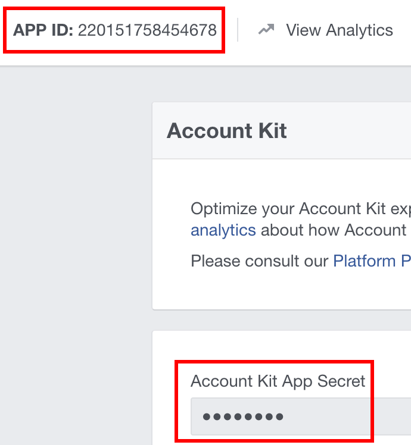

# accountkit-authentication

Allow users to sign up and sign in with AccountKit using Schema Extensions and Graphcool Functions 🙀

> Note: Schema Extensions are currently only available in the Beta Program.

## Getting Started

```sh
npm -g install graphcool
graphcool init --schema accountkit-authentication.graphql
```

## Authentication flow in app

1. The user clicks either the `Login via SMS` or `Login via Email` button
2. The Account Kit UI is loaded and the user accepts
3. The app receives a Account Kit Access Token
4. Your app calls the Graphcool mutation `authenticateAccountKitUser(accountKitToken: String!)`
5. If no user exists yet that corresponds to the passed `accountKitToken`, a new `User` node will be created
6. In any case, the `authenticateAccountKitUser(accountKitToken: String!)` mutation returns a valid token for the user
7. Your app stores the token and uses it in its `Authorization` header for all further requests to Graphcool


> Note: if your API Version is something else than `v1.1`, you need to update that in `login.html`, `login_success.php`, and `accountkit-authentication.js`.

## Setup the Authentication Function

* Create a new Schema Extension Function and paste the schema from `schema-extension.graphql` and code from `accountkit-authentication.js`.
* Create a new Permanent Access Token (PAT) in project settings. *It needs to have the same name as the function to make it available in the execution context of the function.*
* Remove all Create permissions for the `User` type. The function uses a Permanent Access Token to create users via the API so the permissions are not needed.

## Facebook App Setup

### Create a Facebook App

To use Account Kit you need to create a Facebook app and add the `Account Kit` product. Follow [this guide to create an app](https://developers.facebook.com/docs/apps/register) in a few minutes.

For this example, you need to go to `Account Kit > Web Login Settings > Server Domains` and add the domain you will be running login.html from, such as `http://localhost:8000/`


Once you created a new app and added Account Kit, you should have an App ID and an Account Kit App Secret. Replace `{{FACEBOOK_APP_ID}}` in `login.html` and `<facebook_app_id>` in `login_success.php` with your App ID. Replace `<account_kit_app_secret>` in `login_success.php` with your Account Kit App Secret.



### Create a Account Kit Token

To create a test Account Kit Token, create a server using something like [MAMP](https://www.mamp.info) so you can run `login.html` and `login_success.php`

Open `http://localhost:8000/login.html` (port may be different) in your browser and use one of the Login buttons to create a new Account Kit Token.

## Test the Code

First, obtain a valid Account Kit token as mentioned above.

Go to the Graphcool Playground:

```sh
graphcool playground
```

Run this mutation to authenticate a user:

```graphql
mutation {
  # replace __ACCOUNTKIT_TOKEN__!
  authenticateAccountKitUser(accountKitToken: "__ACCOUNTKIT_TOKEN__") {
    token
  }
}
```

You should see that a new user has been created. The returned token can be used to authenticate requests to your Graphcool API as that user. Note that running the mutation again with the same Account Kit token will not add a new user.
